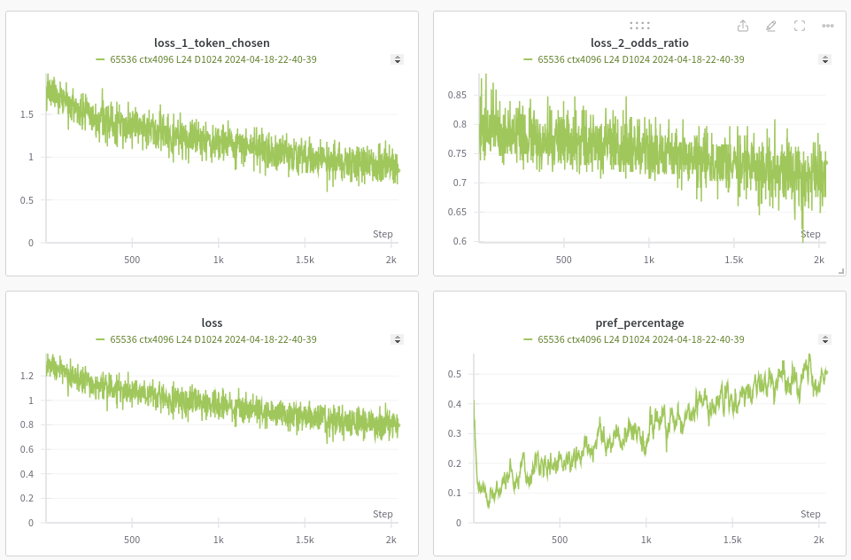

# RWKV-LM-LISA

# WARNING: Eternal Debugging, pre-release.
This repo is forked from RWKV-LM

Test implement of Layerwise Importance Sampled AdamW

if LISA is disabled, it operates in full parameter training mode.
## 2024.04.19 Update
   - Optimized Orpo Algorithm 
   - added the Type1 probability calculation, and if the appropriate Alpha(around 0.0005) is set, it is possible to learn knowledge while aligning. The implementation of Bsz is arbitrary, so multi-batch training is pseudo.
   - In the case of Orpo, it is believed that sufficient training loss reduction can be achieved with training of about two layers from the final layer. If you want to select layers, edit files such as Layer Selection Profile 24_orpo_1layer.csv.
   - adjust the Alpha coefficient while observing the balance between OddsRatio Loss and SFT Loss (e.g., 1:1).
   - Compared to DPO training, since knowledge updating did not go well, I believe Orpo is a realistic option.

## 2024.04.17 Update
1. Implemented Odds Ratio Preference Optimization
   - Orpo adds a penalty based on odds ratio to the usual loss method to tell apart preferred and less preferred response styles.
   - This is experimental code. In Development.(It probably includes incorrect code)
   - If there is a dataset with Chosen and Reject pairs in a common structure along with the DPO dataset, training can be started
   - currently, in testing on RWKV x052 L24D1024 (maybe x060 also work)
## 2024.04.12 Update
1. Implemented Direct Preference Optimization
   - It aims to directly incorporate human preferences and evaluations into the learning model. It directly assesses the desirability of actions taken by the model and optimizes the learning process based on that assessment.
   - This is experimental code.
   - VRAM Heavy. With 24GB of VRAM, dpo-tuning up to 3b is possible. To tune 7b, a minimum of 32GB of VRAM is required....
   - i'm looking for alternatives to grad_cp....
## 2024.04.10 Update
1. Implemented layer selection probability profiling
   - You can now change the selection probability for each layer in CSV format. Perhaps under certain conditions it should be able to contribute to loss optimization

   - we examined the changes in Loss for each layer selection probability profile. Noticeable changes in Loss were observed, with the lowest Loss found in the Valley Profile.

2. Implemented permanent freezing function in layers
   - You can now permanently freeze certain elements during training. This makes it possible to consider modifying the Loss and creating a merge model.
## 2024.04.09 Update
1. Implemented random element freezing function(LISA+)
   - In addition to the existing LISA training method, we randomly freeze some of the elements in the specified layer to improve VRAM efficiency and training speed.
   - Now can train RWKV 7b on 24GB GPU with 4k ctx with ds2 offload
   - tested RWKV v6 1.6b 4kctx ds1 4bsz @ Single 4090 8.5Kt/s 

## Usages
1. Prepare SFT Dataset:
   - Compatible with Original RWKV-LM dataset format
2. Run `train.py`:
   - Currently RWKV-5 and 6 are supported;
   - if use LISA+ set --lisa_plus_enabled 1
   - --lisa_plus_att_train_params　List of att elements to be frozen
   - --lisa_plus_att_active_weight　Number of att elements trained simultaneously
   - --lisa_plus_ffn_train_params　List of ffn elements to be frozen
   - --lisa_plus_ffn_active_weight　Number of ffn elements trained simultaneously
   - if more save VRAM, reduce --lisa_plus_att_active_weight or --lisa_plus_ffn_active_weight
   - --lisa_plus_att_permanent_freeze_params List of att elements to be frozen permanently
   - --lisa_plus_ffn_permanent_freeze_params List of ffn elements to be frozen permanently
   - if use layer selection probability profiling set --lisa_plus_custom_layer_probabilities 1
   - --lisa_plus_custom_layer_probabilities_profile Enter the file name of the profile in CSV format
## Orpo Usages
1. Prepare Orpo Dataset
   - now only support UTF-8 CSV(keys 'prompt','chosen','reject')
   - if you wanna add reject, 
   - ```python rlhf_generate_reject.py --load_model YOURMODEL --input_csv YOURCSV --output_csv OUTPUTDEST ```
   - Tokenize using RWKV models
   - ```python PrepareOrpoDataset.py --load_model YOURMODEL --input_csv YOURCSV --output_save OUTPUTDEST --target_pair_count 1000 ```
2. Run `train.py`:
   - Configure LISA(its better select two layers from the final layer)
   - set --orpo 1 
   - set --orpo_alpha 0.0006 (coefficient while observing the balance between OddsRatio Loss and SFT Loss (e.g., 1:1))
   - set --orpo_type 1 (0 is log based prob compute,1 is sum)
   - set --rlhf_max_corpus_len 600 Maximum Token limit each prompt,chosen,reject for avoid OoM
   - set --rlhf_train_file 'YOUR TOKENIZED DATA FILENAME'
## DPO Usages
1. Prepare DPO Dataset
   - download pref data from HuggingFaceH4/ultrafeedback_binarized
   - edit target rwkv model and target dataset filename in prepare_dpo_dataset.py
   - run prepare_dpo_dataset.py
2. Run `train.py`:
   - Configure LISA
   - set --dpo 1
   - --rlhf_train_file DPO dataset filename
   - --dpo_beta the parameter beta plays a crucial role as it controls how much to weight the preference of the reference model.
   - --rlhf_max_corpus_len it means dpo dataset is limited by dpo_max_corpus_len(ex. prompt 400,chosen 400,reject 400)


## This repo works
   - 1. Freeze all layers
   - 2. Choose active layers(lisa_active_layer) randomly every lisa_interval_steps
   - 3. In chosen layer, freeze elements randomly.(20240409Update)   
   - 4. Foward and backward

I wish performance close to full parameter learning
 
## SFT Mode
My training command is provided as follows:
```
python train.py --load_model "base_model/RWKV-x060-World-1B6-v2.1-20240328-ctx4096.pth"\
 --wandb "RWKV-LM-LISA+ v6 1.6b" --proj_dir "1.6b-output"\
 --data_file "dataset/dataset"\
 --data_type "binidx" --vocab_size 65536 --ctx_len 4096 \
 --epoch_steps 2000 --epoch_count 1000 --epoch_begin 0 --epoch_save 1 \
 --micro_bsz 4 --n_layer 24 --n_embd 2048\
 --lr_init 1e-6 --lr_final 1e-7 \
 --warmup_steps 100 --beta1 0.9 --beta2 0.999 --adam_eps 1e-8 \
 --accelerator gpu --devices 2 --precision bf16 \
 --grad_cp 1 --my_testing "x060" \
 --strategy deepspeed_stage_1 \
 --lisa 1 \
 --lisa_active_layer 1 \
 --lisa_interval_steps 5 \
 --lisa_debug 1 \
 --lisa_rand_seed 0 \
 --lisa_plus_enabled 1 \
 --lisa_plus_att_train_params "att.receptance.weight,att.key.weight,att.value.weight,att.gate.weight,att.output.weight" \
 --lisa_plus_att_active_weight 3 \
 --lisa_plus_ffn_train_params "ffn.receptance.weight,ffn.key.weight,ffn.value.weight" \
 --lisa_plus_ffn_active_weight 2 \
 --lisa_plus_att_permanent_freeze_params '' \
 --lisa_plus_ffn_permanent_freeze_params '' \
 --lisa_plus_custom_layer_probabilities 1\
 --lisa_plus_custom_layer_probabilities_profile 'layerprofile/24_Flat.csv' \
 --gpu_arch rocm
```

## DPO Mode
My dpo training command is provided as follows:
```
python train.py --load_model "base_model/RWKV-5-World-3B-v2-20231113-ctx4096.pth"\
 --wandb "RWKV-LM-LISA+ DPO 3b" --proj_dir "3b-dpo"\
 --vocab_size 65536 --ctx_len 4096 \
 --epoch_steps 200 --epoch_count 1000 --epoch_begin 0 --epoch_save 1 \
 --micro_bsz 1 --n_layer 32 --n_embd 2560\
 --lr_init 1e-6 --lr_final 1e-7 \
 --warmup_steps 100 --beta1 0.9 --beta2 0.999 --adam_eps 1e-8 \
 --accelerator gpu --devices 1 --precision bf16 \
 --grad_cp 0 --my_testing "" \
 --strategy deepspeed_stage_2_offload \
 --gpu_arch cuda \
 --lisa 1 \
 --lisa_active_layer 1 \
 --lisa_interval_steps 5 \
 --lisa_debug 1 \
 --lisa_rand_seed 0 \
 --lisa_plus_enabled 1 \
 --lisa_plus_att_train_params "att.receptance.weight,att.key.weight,att.value.weight,att.gate.weight,att.output.weight" \
 --lisa_plus_att_active_weight 3 \
 --lisa_plus_ffn_train_params "ffn.receptance.weight,ffn.key.weight,ffn.value.weight" \
 --lisa_plus_ffn_active_weight 2 \
 --lisa_plus_att_permanent_freeze_params '' \
 --lisa_plus_ffn_permanent_freeze_params '' \
 --lisa_plus_custom_layer_probabilities 1 \
 --lisa_plus_custom_layer_probabilities_profile 'layerprofile/32_Valley.csv' \
 --dpo 1 \
 --dpo_beta 0.08 \
 --rlhf_max_corpus_len 600 \
 --rlhf_train_file trainset.save
```

## Orpo Mode
My orpo training command is provided as follows:
```
python train.py --load_model "base_model/RWKV-5-World-0.4B-v2-20231113-ctx4096.pth"\
 --wandb "RWKV-LM-LISA+ Valley v5 0.4b orpo experiment" --proj_dir "0b4orpo"\
 --vocab_size 65536 --ctx_len 4096 \
 --epoch_steps 1250 --epoch_count 1000 --epoch_begin 0 --epoch_save 1 \
 --micro_bsz 1 --n_layer 24 --n_embd 1024\
 --lr_init 5e-6 --lr_final 1e-6 \
 --warmup_steps 100 --beta1 0.9 --beta2 0.999 --adam_eps 1e-8 \
 --accelerator gpu --devices 1 --precision bf16 \
 --grad_cp 0 --my_testing "" \
 --strategy deepspeed_stage_1\
 --lisa 1 \
 --lisa_active_layer 2 \
 --lisa_interval_steps 5 \
 --lisa_debug 1 \
 --lisa_rand_seed 0 \
 --lisa_plus_enabled 1 \
 --lisa_plus_att_train_params "att.receptance.weight,att.key.weight,att.value.weight,att.gate.weight,att.output.weight" \
 --lisa_plus_att_active_weight 3 \
 --lisa_plus_ffn_train_params "ffn.receptance.weight,ffn.key.weight,ffn.value.weight" \
 --lisa_plus_ffn_active_weight 2 \
 --lisa_plus_att_permanent_freeze_params '' \
 --lisa_plus_ffn_permanent_freeze_params '' \
 --lisa_plus_custom_layer_probabilities 1\
 --lisa_plus_custom_layer_probabilities_profile 'layerprofile/24_orpo_2layer.csv' \
 --gpu_arch cuda \
 --orpo 1 \
 --orpo_alpha 0.0006 \
 --orpo_type 1 \
 --rlhf_max_corpus_len 600 \
 --rlhf_train_file trainset.save
```

## Anarchy Mode
   - --anarchy_mode 1
   - When Anarchy mode is enabled, you are free to add layers as you please. This allows for the addition of layers, such as 16 layers, to existing models like L24D1024, enabling training. With this feature, you can create and train models with any number of parameters you like. This functionality is entirely whimsical and comes with no guarantees. It's a mode meant for experimentation.

## Todo
   - 1. (Done)Make a layer selection probability profile
   - 2. (Done?)Implement Direct Preference Optimization with LISA
   - 3. (In development)Implement Odds Ratio Preference Optimization with LISA
   - 4. Multi Batch Training
   - 5. Implement Layer Variable Rank LoRA with LISA
   - 6. Implement Quant from RWKV-PEFT(@JL-er)
   - 7. Implement DPO and Orpo in Infctx Trainer(BPTT)

# And Thanks to:
   - RWKV-LM @BlinkDL
   - RWKV-LM-RLHF-DPO @Triang-jyed-driung
   - LMFlow @OptimalScale
   - Orpo @xfactlab


# License
same with RWKV-LM

Apache 2.0


@ 2024 OpenMOSE
