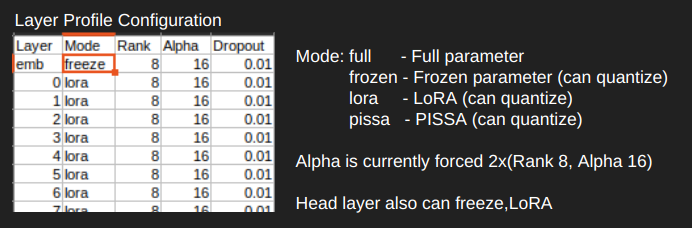

# RWKV-LM-RLHF
<p align='center'>
<image src="kotori.webp" width=15%/>
</p>

<div align="center"> 
A repository exploring the possibilities for deeper fine-tuning of RWKV.
</div>


## Key Features

- **RLHF Training with ORPO(Odds Ratio Preference Optimization)**: 

  ORPO is that it allows for simultaneous SFT and aligning. By adjusting the orpo_alpha value, you can control the ratio between SFT and aligning.
   - Uses odds ratios instead of probability ratios to measure policy changes

   - Can often achieve better performance with fewer training steps

   - Designed to mitigate common issues in RLHF like reward hacking and overoptimization

- **RLHF Training with DPO(Direct Preference Optimization)**: 

  Direct Preference Optimization (DPO) is an advanced training method for Large Language Models that aims to align model outputs with human preferences more effectively than traditional methods.
   - Directly optimizes for human preferences without the need for a separate reward model

   - Simplifies the training pipeline compared to other preference learning methods

   - More stable training process compared to RL-based methods

- **Infinite Context Compression Distillation Training**:
  - This approach involves simultaneously training a student model using compressed logits data pre-acquired from a larger parameter model (for example, 14B) as soft labels, and the dataset as hard labels.

  - Soft label learning can significantly reduce the risk of overfitting.

  - It allows for efficient transfer of specific tasks to smaller models.
- **Infinite Context Masked SFT with Smoothing Loss**:
  - By incorporating smoothing into the loss calculation, the transfer probability can be increased.

  - Dynamic masking allows for efficient loss reduction during multi-batch processing.

  - With an RTX4090, a 14B parameter model can be trained with 65k contexts.

## Peft Training Backend

- **Bone (Block Affine Transformation)**: 
   - New training method proposed by @Jl-er
   - Achieve faster convergence and better fit to data.
   - No complex initialization is required, and fast convergence and better fit to data can be achieved.
- **PiSSA（Principal Singular values and Singular vectors Adaptation）**: 
   - Optimize essential singular values ​​and vectors, and freeze the "noise" parts.
   - Compared to LoRA, it converges much faster and has better final performance.
- **LoRA**: 
   - Updates to large weight matrices are approximated by products of low-rank matrices.
- **Quantization**:
   - FP8: Fastest. Native matmul. Only works with NVIDIA H100, RTX4090.
   - Int8: 8-bit quantization with Bitsandbytes. 16-bit Matmul
   - NF4: 4-bit quantization with Bitsandbytes. 16-bit Matmul

> Rank can be set variably for each layer. see layer_profile

## System Requirements
   - CPU RAM >= 32GB
   - Cuda or Rocm GPU.(NVIDIA RTX3090,4090, AMD MI100)
   - CUDA 12.4+, Rocm 6.2+
   - Python 3.12+
   - Pytorch 2.5+
   - Bitsandbytes (in MI100 with Rocm6.2.2, need build)
   - some case need (conda install libstdcxx -c conda-forge --override-channels) for building cuda kernel

## How to Use
   - [Odds Ratio Preference Optimization document](v6/example/ORPO/readme.md)
   - [Direct Preference Optimization document](v6/example/DPO/readme.md)
   - [Distillation document](v6/example/Distillation/readme.md)
   - [SFT document](v6/example/SFT/readme.md)
   - [Layer Profile](v6/layerprofile/readme.md)


## Orpo Usages
1. Prepare Orpo Dataset
   - now only support UTF-8 CSV(keys 'prompt','chosen','reject')
   - if you wanna add reject, 
   - ```python rlhf_generate_reject.py --load_model YOURMODEL --input_csv YOURCSV --output_csv OUTPUTDEST ```
   - Tokenize using RWKV models
   - ```python PrepareOrpoDataset.py --load_model YOURMODEL --input_csv YOURCSV --output_save OUTPUTDEST --target_pair_count 1000 ```
2. Run `train.py`:
   - Configure layer_profile (its better select full layers)
   
   - set --orpo 1 
   - set --orpo_alpha 0.0004 (coefficient while observing the balance between OddsRatio Loss and SFT Loss (e.g., 1:1))
   - set --rlhf_max_corpus_len 1024 Maximum Token limit each prompt,chosen,reject for avoid OoM
   - set --rlhf_train_file 'YOUR TOKENIZED DATA FILENAME'


## Orpo Mode
My orpo training command is provided as follows:
```
python train.py --load_model "models/rwkv-x060-14b-world-v2.1-81%trained-20240527-ctx4k.pth"\
 --wandb "RWKV-LM-RLHF 14b Rocm Test" --proj_dir "14brocm-bf16"\
 --vocab_size 65536 --ctx_len 2048 \
 --epoch_steps 1000 --epoch_count 1000 --epoch_begin 0 --epoch_save 1 \
 --micro_bsz 1 --n_layer 61 --n_embd 4096\
 --lr_init 5e-6 --lr_final 1e-6 \
 --warmup_steps 100 --beta1 0.9 --beta2 0.999 --adam_eps 1e-8 \
 --accelerator gpu --devices 2 --precision bf16 \
 --grad_cp 1 --my_testing "x060" \
 --strategy deepspeed_stage_1 \
 --layer_profile 'layerprofile/61_TEST_head_emb.csv' \
 --quant 1 \
 --quant_mode 'nf4'\
 --gpu_arch 'rocm' \
 --orpo 1 \
 --orpo_alpha 0.0004 \
 --rlhf_train_file dataset_3b.save \
 --rlhf_max_corpus_len 1024
```

## Model Merge
My model merge command is provided as follows:
```
base_model='models/rwkv-x060-14b-world-v2.1-81%trained-20240527-ctx4k.pth'
lora_checkpoint='14bwo-head-emb/rwkv-1.pth'
output='14bwo-head-emb/rwkv-1-merged.pth'
QUANT='nf4' #follow train
TYPE='lora'
Lora_scaling=2.0

python merge.py --base_model $base_model \
--lora_checkpoint $lora_checkpoint \
--output $output \
--type $TYPE \
--lora_scaling $Lora_scaling
```

## Todo
   - 1. Re-engineering DPO Algorithm with Gradient Checkpointing - Test implemented.
   - 2. SimPO research - Cancelled
   - 3. Self-Play ORPO research - Cancelled
   - 4. Re-engineering LISA+ - Cancelled
   - 5. support FLA backend(help me...) - Test implemented.
   - 6. Compression Distillation - Test implemented.
   - 7. infctx Orpo


# And Thanks to:
   - RWKV-LM @BlinkDL
   - RWKV-LM-RLHF-DPO @Triang-jyed-driung
   - RWKV-PEFT @Jl-er
   - LMFlow @OptimalScale
   - Orpo @xfactlab


# License
same with RWKV-LM

Apache 2.0


@ 2024 OpenMOSE
