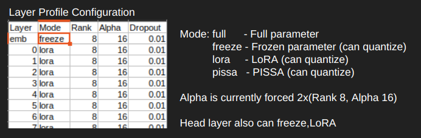

## Layer Profile
In LayerProfile, you can choose to freeze, fully train parameters, or apply PEFT learning individually for layers such as the Embedding layer, Block layers, and Head layer.
For PEFT learning methods, you can select from bone, pissa, or lora.
Note that mixing multiple PEFT learning methods is not possible.

# 🚀 Optimizing LoRA Rank Distribution for Efficient LLM Fine-tuning

## 🎯 Objective
Maximize LLM fine-tuning effectiveness within limited VRAM constraints through strategic LoRA rank variation across layers.

## 🧠 Key Concept
| Layer Type | LoRA Rank | Rationale |
|------------|-----------|-----------|
| Embedding  | Higher    | Direct input interaction |
| Intermediate | Lower   | General feature capture |
| Head       | Higher    | Direct output generation |

## 💡 Benefits
- **Resource Optimization**: Efficient VRAM utilization
- **Performance Enhancement**: Improved task-specific adaptation
- **Flexible Fine-tuning**: Tailored layer-wise adjustments
- **Overfitting Mitigation**: Controlled parameter allocation

## 🛠️ Implementation Strategies
1. **Gradual Rank Transition**: Smooth rank changes across layers
2. **Dynamic Rank Adjustment**: Adaptive rank modification during training
3. **Complementary Techniques**: 
   - Gradient checkpointing
   - Mixed-precision training
4. **Continuous Monitoring**: VRAM usage and layer-wise gradient flow

## 🧪 Experimental Approach
1. Establish baseline (uniform LoRA ranks)
2. Test varied rank configurations
3. Analyze performance-VRAM trade-offs
4. Fine-tune auxiliary hyperparameters

> 💼 **Pro Tip**: Adapt rank distribution based on specific task requirements and available hardware resources.

## 🌟 Conclusion
This innovative approach balances model adaptability with resource constraints, potentially revolutionizing LLM fine-tuning on limited hardware. Remember: thorough experimentation is key to unlocking its full potential!